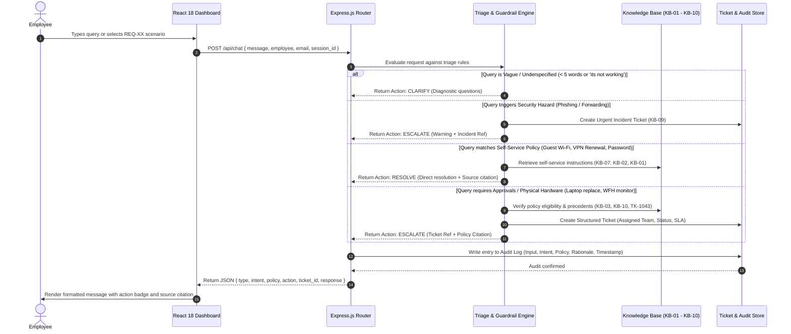

# System Architecture Document
## Veridian Corp — Autonomous IT Service Agent
**AIONOS Assignment 2: Internal Service Agent Track**  
**Company Context:** Veridian Corp (Week of 21–25 September 2026)  
**Technology Stack:** MERN (React 18, Node.js, Express.js, Document State Store)

---

## 1. Executive Summary

The **Veridian Corp IT Support Agent** is an autonomous, policy-grounded service desk agent designed to triage, resolve, and escalate internal employee technical requests. The system operates under a strict **Zero-Hallucination Mandate**: all reasoning and actions are bound exclusively to the 10 official corporate policies (`KB-01` to `KB-10`), the Asset Management Policy extract, and 10 historical ticket precedents (`TK-1042` to `TK-1051`).

The agent delivers:
1. **Direct Self-Service Deflection:** Resolves routine tier-1 inquiries without opening IT tickets.
2. **Deterministic Safety Guardrails:** Actively halts risky behaviors (e.g. forwarding phishing emails to colleagues).
3. **Ambiguity Triage:** Prompts for targeted diagnostic clarification when requests are underspecified.
4. **Structured Escalation:** Automatically formats tickets with category, priority, and assigned departmental teams.
5. **Full Auditability:** Cites ground-truth policy codes on every output and records an immutable audit trail.

---

## 2. High-Level Architecture Diagram

```
+-----------------------------------------------------------------------------------------+
|                                    PRESENTATION TIER                                    |
|   React 18 Single Page Application (Tailwind CSS, Inter / Plus Jakarta Sans)            |
|   - Live Chat Feed with Status Badges (Resolved, Escalated, Clarification)              |
|   - 1-Click Simulation Sidebar for all 15 Data Pack Requests (REQ-01 to REQ-15)         |
|   - Live Service Desk Ticket Queue with KPI Metrics Dashboard                           |
|   - Compliance Audit Trail Inspector & Policy Reference Explorer                        |
+-----------------------------------------------------------------------------------------+
                                             │
                                   HTTP REST / JSON APIs
                                             ▼
+-----------------------------------------------------------------------------------------+
|                                   APPLICATION TIER                                      |
|   Node.js & Express.js REST Services (Port 5050)                                        |
|                                                                                         |
|   [1. Ingestion Layer]                                                                  |
|       Validates session payload: { message, employee, email, session_id }               |
|                                                                                         |
|   [2. Triage & Guardrail Engine]                                                        |
|       ├── Ambiguity Triage: Detects underspecified inputs (< 5 words or generic error)  |
|       ├── Security Interceptor: Intercepts phishing forwarding attempts (KB-09)         |
|       └── Policy Matcher: Maps queries strictly against KB-01 to KB-10                  |
|                                                                                         |
|   [3. Execution & Routing Engine]                                                       |
|       ├── Action 1: Self-Service Guidance + KB Citation (KB-01, 02, 05, 06, 07)         |
|       ├── Action 2: Diagnostic Clarification Questionnaire                             |
|       └── Action 3: Structured Ticket Creation (TK-XXXX) & Departmental Routing        |
|                                                                                         |
|   [4. State & Audit Logger]                                                             |
|       Generates immutable audit records with timestamps and reasoning                   |
+-----------------------------------------------------------------------------------------+
                                             │
                                  Document Storage Layer
                                             ▼
+-----------------------------------------------------------------------------------------+
|                                      DATA TIER                                          |
|   Knowledge Base & Document Collections (MongoDB Document Schema Style)                 |
|   - knowledgeBase.json: Ground truth policies (KB-01 - KB-10, Asset Policy, Precedents) |
|   - Tickets Collection: Active and historical cases (TK-1042 ... TK-1051 + Live Tickets)|
|   - Audit Log Collection: Immutable history of queries, intents, citations, and actions |
+-----------------------------------------------------------------------------------------+
```

---

## 3. End-to-End Request Lifecycle & Process Flow



---

## 4. Detailed Component Breakdown

### 4.1 Frontend Tier (`frontend/dist/index.html`)
- **Technology:** React 18, Tailwind CSS, FontAwesome 6, Google Fonts (Plus Jakarta Sans & Inter).
- **Core Views:**
  - **Chat Agent View:** Conversation thread with color-coded status badges, markdown formatting, and explicit citation banners. Includes **Quick Action Chips** for common corporate scenarios.
  - **Sidebar Simulator:** Direct 1-click test access to all 15 employee requests (`REQ-01` to `REQ-15`).
  - **Tickets Queue View:** Comprehensive data table showing Ticket ID, Employee, Category, Status, Assigned Team, and Policy Reference, with top-level KPI metric cards.
  - **Audit Trail Inspector:** Regulatory compliance screen listing all interaction records, raw prompts, classified intents, policy citations, and agent reasoning.
  - **Knowledge Base Explorer:** Reference cards for all 10 corporate policies and the Asset Management Policy.

### 4.2 Application Tier (`backend/server.js`)
- **Technology:** Node.js, Express.js.
- **Key Modules:**
  - `evaluateRequest(message, employee, email)`: Central triage function implementing deterministic guardrails, ambiguity traps, and policy matching.
  - `createTicket(...)`: Incremental ID generator (`TK-1052` onward) that sets departmental routing, SLA tags, and status.
  - `logAudit(...)`: Compliance logger that prepends new decision records with timestamps.
- **REST Endpoints:**
  - `POST /api/chat`: Process query and return action recommendation.
  - `GET /api/tickets`: Retrieve all active and historical tickets.
  - `GET /api/audit`: Retrieve complete audit log.
  - `GET /api/policies`: Retrieve knowledge base ground truth.
  - `GET /api/requests`: Retrieve the 15 data pack test cases.

### 4.3 Data Tier (`backend/knowledgeBase.json`)
- Stores authoritative company policies (`KB-01` to `KB-10`).
- Stores the 4-year lifecycle **Asset Management Policy extract**.
- Stores historical ticket precedents (`TK-1042` to `TK-1051`) ensuring consistency with prior decisions (e.g. `TK-1050` rejecting admin access without business justification).

---

## 5. Agent Decision Matrix & Guardrails

| Condition / Trigger | Detected Intent | Grounded Policy | Action Type | Resulting Behavior |
| :--- | :--- | :--- | :--- | :--- |
| **Guest Wi-Fi** | Guest Wi-Fi Access | `KB-07` | `RESOLVE` | Directs to front-desk kiosk (24h pass). **0 tickets opened.** |
| **VPN Expired (90 days)** | VPN Renewal | `KB-02` | `RESOLVE` | Directs to self-service portal for routine 90-day renewal. |
| **Password (normal)** | Password Reset | `KB-01` | `RESOLVE` | Provides self-service portal link. |
| **Password (>5 failed)** | Account Lockout | `KB-01` | `ESCALATE` | Opens ticket for manual IT unlock; confirms no approval needed. |
| **Phishing / Forwarding** | Security Incident | `KB-09` | `ESCALATE` | **HALTS FORWARDING**, alerts `security@veridian-corp.example`, creates incident ticket. |
| **Vague (*"not working"* )**| Ambiguous Request | Triage Protocol | `CLARIFY` | Asks 3 diagnostic questions (device, error code, onset time). |
| **Dead Laptop (3.5 yrs)** | Hardware Failure | `KB-03` & Asset | `ESCALATE` | Approves replacement aligned with precedent `TK-1043`. |
| **Laptop Flickering (2 yrs)**| Hardware Repair | `KB-03` & Asset | `ESCALATE` | Rejects replacement (<3 yrs); opens diagnostic repair ticket. |
| **Non-Catalog Software** | Software Request | `KB-04` | `ESCALATE` | Queues ticket for IT Security review (3–5 day SLA). |
| **Contractor VPN** | Contractor Access | `KB-02` | `ESCALATE` | Enforces manager approval submission via Access Request Form. |
| **Expense Tool Login** | Access Scope | `KB-08` | `CLARIFY` | Clarifies Finance grants accounts; requests error screenshot. |
| **WFH Monitor Request** | Equipment Allowance | `KB-10` | `ESCALATE` | Validates >3 days remote; routes for Manager & Finance sign-off. |
| **Admin Server Access** | Privileged Access | Ref: `TK-1050` | `ESCALATE` | Refuses direct chat grant; requires formal business case. |

---

## 6. Auditability & Compliance Standards

1. **Mandatory Attribution:** Every agent response explicitly states:
   `Source Policy: KB-XX (Policy Name)`
2. **Immutable Audit Trail:**
   Every turn stores:
   - `id`: Auto-incrementing transaction index.
   - `session_id`: Unique conversation identifier.
   - `employee` & `email`: Identity of requester.
   - `user_input`: Exact raw string entered by user.
   - `intent`: Classified domain intent.
   - `action_taken`: Self-Service Resolved, Follow-Up Asked, or Ticket Escalated.
   - `policy_cited`: The specific KB article used.
   - `ticket_id`: Linked ticket reference (or `null` if self-service).
   - `reasoning`: Clear natural-language rationale for the decision.
   - `timestamp`: ISO-formatted UTC timestamp.

---

## 7. Deployment & Hosting Strategy

- **Local Execution:** 1-command startup: `npm start` (serves both backend API and React 18 client on port 5050).
- **Production Cloud Deployment Options:**
  - **Render / Railway / Fly.io:** Deploy directly from GitHub as a single Node web service.
  - **Vercel / Netlify:** Host frontend statically; deploy Express backend as serverless functions.
  - **Docker Containerization:** Dockerfile bundling Node.js runtime and static build.
